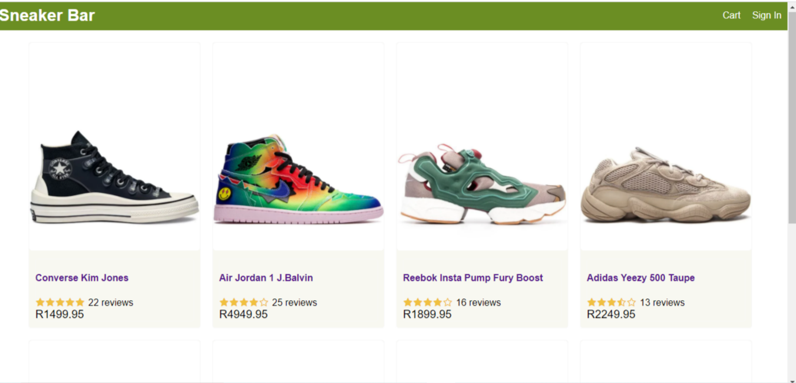

# Merch

## About

Online shopping website, initially named it **Merch** but later changed it to **Sneaker Bar** as it only contains sneakers.

Allows user to register and sign in, add items to cart, pay using card or paypal, edit user profile, view order history and also has an admin view only visible to administrators.

## Website

https://sneakerbar.herokuapp.com

## Technologies

- HTML5, CSS3 and Javascript
- React: Components, Props, Events, Hooks, Router, Axios
- Redux: Store, Reducer, Actions
- Node and Express
- MongoDB
- Deployment: Heroku

## Run Locally

 git clone git@github.com:Leatile/merch

 cd merch

## Setup MongoDB

- Local MongoDB
  - Install MongoDB
  - Create .env file in root folder and set MONGODB_URL=mongodb://localhost/merch
- Atlas MongoDB
  - Create a database at Atlas MongoDB
  - Create .env file in root folder and set
 MONGODB_URL=mongodb+srv://your-db-connection

## Run Backend

 npm install

 npm start

 

## Run Frontend

### ~open new terminal

 cd frontend

 npm install

 npm start
